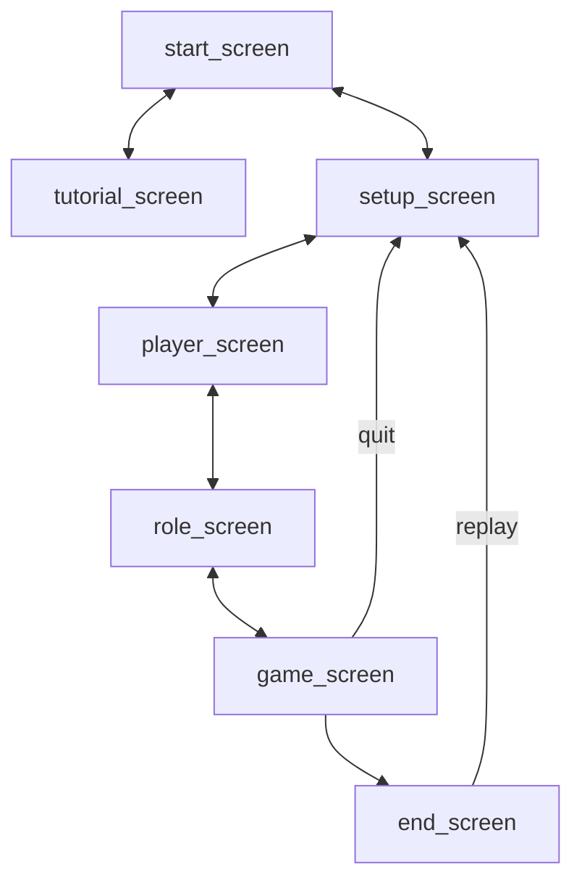

# Screens
The app is composed of different screens, each serving a distinct purpose.
Below is a diagram showing how the user can navigate these screens
    

| Platform      | Description      |
|--------------|--------------|
| **start_screen**   | Initial screen when user opens app. |
| **tutorial_screen**   | Explains basic game rules and roles. |
| **setup_screen**| Allows the user to configure game settings.     |
| **player_screen**   | Lets the user add player names.     |
| **role_screen**     | Lets each player privately view their role.      |
| **game_screen**     | Where the main game occurs with the day/night stages.      |
| **end_screen**     | Reveals the winning team and player roles.      |
